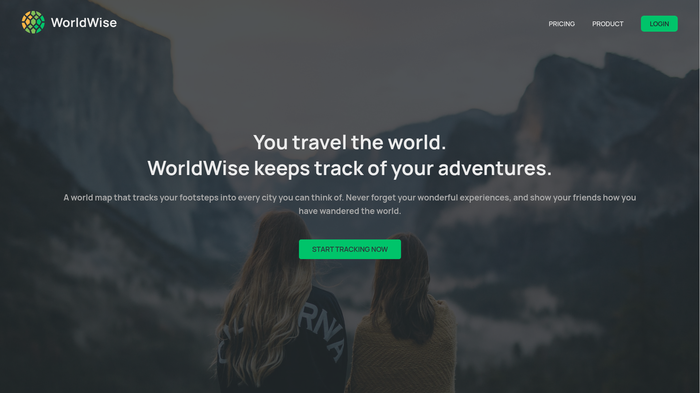
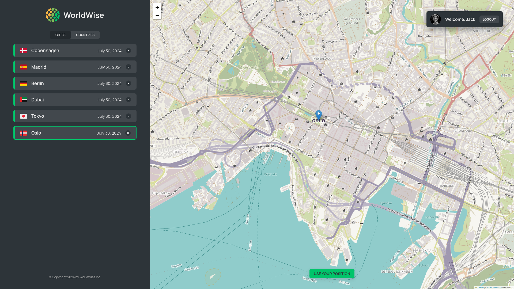

# 🌎 WorldWise

<div align='center'>

  


</div>




## Description

A React application designed to help you monitor your travels and create a visual log of your adventures

## Features

### Interactive World Map

- WorldWise displays a world map with markers for all the cities that the user has added to their list. 🌍

### City List

- WorldWise displays a list of all the cities that the user has added. The list includes 🏙️
  - City name
  - Country flag
  - Date of visit

### City Form

- When the user clicks on a city on the map or in the list, WorldWise displays a form with information about the city, including 📝
  - City name
  - Country flag
  - Date of visit
  - Notes about the trip

### Add City

- The user can add a city to their list by filling out the city form and clicking the ➕ button. A marker will then appear on the map for the new city

### Remove City

- The user can remove a city from their list by clicking the ❌ button next to the city in the list. The marker for the city will then be removed from the map

### Current User Geolocation

- The user can click the "USE YOUR POSITION" button to navigate the map to their current geolocation📍

### Login and Logout Functionality

- WorldWise allows users to log in and out of their accounts 🔐

### Local Storage

- The list of cities is persisted in local storage, ensuring the user's list is preserved even if they close the browser or navigate to a different page 💾

### Tab Component

- WorldWise has a tab component that displays a list of cities and corresponding countries that the user added. This allows users to quickly switch between different views of their list 📑

## Technologies Used

- React
- JavaScript
- HTML
- CSS
- Leaflet library
- Vite

## Installation

To run this project locally, you can follow these steps:

1. Clone the repository:
   ```
   $ https://github.com/imadosan/WorldWise.git
   ```
2. Open the project folder in your code editor of choice.
3. Install dependencies and packages
   ```
   $ npm install
   ```
4. Run the application
   ```
   $ npm run dev
   ```
